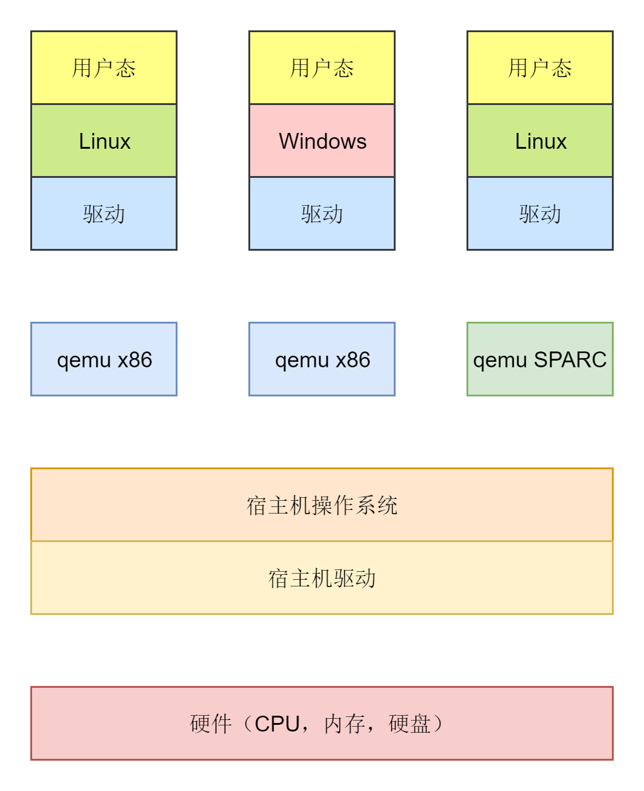

# 图引擎

### 背景

组内被交接若干推荐业务，如框词，相关搜索，联想词等，老大希望借着交接进行一波重构，使用tx的技术重做一遍，分配过来的任务就是设计通用的图引擎框架。

* 没有引擎框架下，代码是写成大坨的if else用于应对各个分支各个场景。经常会遇到的问题就是在a场景下改对了，但是在b场景下错了，需要触发大量的回归逻辑去验证是否影响了其他场景；且代码量过大不利于协作，因为很难分清分工，不光是召回，排序之间的分工，组内的分工也很难通过大坨代码来明确：有的同学可能只负责某一路或者某几路召回
* 有了引擎框架，相当于设计了马路和交通规则，车可以有规则有规律的通行。结合前面的问题，逻辑之间独立性更好，开发的时候可以只关注自己一小块内的逻辑，不用担心对其他业务的影响，因为引擎给做好了隔离；这样没有回归成本，交接和维护的效率更高，另外算子之间可以快速复用，实现逻辑copy，起到提高人效的结果

### 方案

业内通常有两种思路的引擎框架，一种是控制流思想，一种是数据流思想。

* 控制流思想：执行完a后执行b，执行完b后执行c和d，是一种边驱动的思路。控制流最后的配置表达大概率是一种森林或者森林的变体，即多个维度的二叉或者多叉树。树只能往下开叉但是不能合叉，这是与图的最大区别。数据放在一个总线数据结构里，简称sess。
  * 这种框架的好处是思路简单，逻辑清晰，因为可以非常直观的确认某个节点的执行时机，比如b就是在a执行完后执行的这样。所以无论开发还是调试，都会比较容易
  * 坏处也比较明显，天花板比较低。控制流思想下如果想要做一些耗时优化，其实只能通过手动调整节点的执行时机来实现一种短板原理的效果。当前实际业务中确实耗时大头不在业务上，所以如果业务简单可以通过控制流框架做。
  * 典型代表，go有一个web框架叫gin，alimama有一个框架叫orc。以及ali aios的tpp（这个可能比较有争议）
* 数据流思想：一种靠数据依赖驱动的执行方式，最后的配置表达式一种有向无环图。思路大概是a输出outputA，b输出outputB，c执行需要依赖outputA和outputB，那c就可以在a和b执行完成后自动执行。实际执行时候拓扑排序就可以，判定节点的deps然后deps为0的自动执行
  * 好处：耗时最优解，也是目前主流的思路
  * 坏处：开发调试都会比控制流复杂。最典型的问题，图到底怎么表达
  * 典型代表：机器学习的框架如tensorflow，pytorch都是类似；go的话有一个taskflow是个离线任务调度的实现。ali的aios底层有一个框架叫suez turing，本质就是tensorflow

### 目标

因为面临的交接任务比较多，所以需要设计一套能快速迭代，快速复用的引擎框架，另外排查效率要高，因为对于一个业务重构，排查问题可能比开发的时间成本更高。再有就是基础的性能要求等。

还有一个问题是团队是写go的，需要一个go的引擎框架，如果用c++，司内有trs，其实这样解决方案最好，因为设计方案时候肯定优先考虑公司内解决方案，但团队内开发都转技术栈不现实。另外就是找开源解决方案，如上面说的gin，go的taskflow。taskflow主要问题是偏离线计算任务调度，且他构图时候是典型的那种手写edge关系，很难用到线上生产。所以最后只能自己开发个框架。

### 思路

<figure><figcaption></figcaption></figure>

第一套设计的框架是控制流的框架，主要是借鉴go的gin框架。总线式数据结构，然后将执行过程拆解成若干二维数组（对应上面一种简化的森林表达），丰富了如下的特性：

* 支持中断信号：典型的召回是有一段式召回，二段式召回，多段式召回的。如果一段已经走失败了，二段没有必要往下走了，因此需要支持中断的特性。实际这个特性的实现有两种方式，第一种通过算子是否返回err状态判定，另一种是往ctx里手动写terminate信号，只影响单个一维数组的执行。
* 支持控制信号：一些推荐场景比如命中了政治敏感词，可能没必要走什么召回流程了需要提前返回。实现的思路是在sess里带了一个global字段写入一些全局信号，然后框架执行时候可以注册hook函数，在算子实际执行的时候可以先走hook然后再走算子。
* 基础性能优化：总线式数据结构表达为一个全局map。这个必须是全局map，因为框架要求通用性，case by case的数据结构定义无法满足框架通用执行要求（跟go语言自身不完全的面向对象特性也有关），那所有算子高频访问map，就需要一些分段锁优化。另外因为是静态图，所以执行之前就可以知道算子数量，那就可以做map的预分配，map的内存池回收等。还可以做goroutine池化等。（实测goroutine池化效果最差，因为go自身的goroutine已经优化非常好了，goroutine池化只有一个场景有用，就是突发流量触发大量goroutine分配。但是实际线上业务的流量曲线都平滑，不会有这个问题）
* 协议优化：go的protobuf实现有一些毛病，google在21年的时候将map的反序列化都改为了reflect的实现。reflect又是go典型的性能较差的场景，然后特征场景的协议基本都是kkv，大量用到了map。所以需要针对go的pb单独做优化，第一次优化用的是viteproto技术，思路就是把map反序列中的reflect改为case by case的生成；第二次优化就是用flatbuffer，直接将反序列化成本降为0。flatbuffer不支持map的结构，通过vector+二分查找来实现。
* 一些simd的支持：业务场景较小没有部署单独粗排服务，本地做向量化计算来实现粗排，典型的大量浮点数计算操作，这里用了开源的vek库。
* 一些JIT的支持：如各种数据上报等用了json格式，使用sonic来实现jit，达成一些性能优化
* 逻辑和配置分离：图结构用单独配置表达，算子配置另外用一个大map实现，好处是如果修改逻辑的时候直接修改图结构就可以，修改成本低，提升研效

这套框架仍然是线上主要用的框架场景，上线后机器成本降低约13%（得益于性能优化，协议优化等），研发效率从2\~3降低到半天可以上。针对rs场景线上大概有230多个算子

这套框架的缺点：

* 上面提到的性能问题，耗时只能靠人工调整算子执行顺序实现；至于总线数据的读写冲突倒还好，都是多读场景
* 实验：控制流框架对实验的支持比较不友好，只能写出所有可能分支，然后通过中断的方式执行某一路分支

第二套框架的设计，背景是trs找到我们希望我们使用中台，但是基于前面说的背景问题不能全团队转技术栈，于是最后折衷变成我们实现一套trsgo，这样中台宣称接入了新业务，业务宣称参与了中台共建并技术输出。实现技术输出的话希望用一套天花板更高的框架，引发设计第二套数据流的框架。

数据流框架首先要解决图怎么表达问题：

* 第一种思路：代码硬写构造图。手动定义vertex和edge的连接关系。go的taskflow就是类似思路。缺点很明显，200多个算子，靠代码构造图，修改和编写的成本都太高。
* 第二种思路：用配置构造图。这种是一种思路，但是跟上面其实相同的问题，当算子200多个的时候，通过配置无法直观理解整个业务的执行顺序（对比之下，控制流就没有这个问题），修改调试起来也会困难。
* 第三种思路：用配置加可视化平台，通过可视化平台来解决上述修改问题。这种是理想的解决思路，也是大多数大公司的解决方案（trs，tpp，alimama主搜的框架），但是对于小规模业务团队，不太可能出前端人力建设个可视化平台。

最后的解决思路是参考pytorch的思想，用go的tag实现离线元编程，实现图推导功能

* 比如算子a输出outputA，强制要求所有想要依赖算子a输出的，都要定义变量名为outputA
* 这样结合go的tag，可以知道这个变量是in还是out
* go里有reflect，可以通过struct.field等获取到算子所有变量名输入输出结构
* 这样就可以实现离线推导：代码只要写好了，离线获取算子的in和out，通过变量名实现一一映射的关系，从而得到所有算子的相互执行依赖关系。然后离线构造出来图结构（对应上面的方式1），从而得到最后的图表达。

这种实现缺点也很明显：

* 破坏了算子复用性：如果需要新增一个算子，需要对一个算子做copy，然后rename他的输入输出才能实现。这种问题在实验下会放大的比较明显
* 开发逻辑对比以前会复杂：控制流下直接注重实现算子，图逻辑编排在配置实现；在数据流下，需要先做一次codegen，生成图edge代码等才可以。多一步开发流程
* 配置问题：图推导会导致配置重新生成，即对之前配置没有记录，需要改进

解决这些问题的思路：

* 引入id机制：用id+算子输出来实现唯一性。id需要做到配置里不能定义到tag里，因为定义到tag里还是跟rename output没有区别。这样多少有点悖论：有了配置了可能也就不需要推导了。核心在于用id实现output的去重。
* 引入aggragate，聚合相同output结构的输出，结合op的name实现唯一性。跟id其实有一些类似，就是在output名上增加了name

但最后因为dag框架本身并没有比控制流框架带来研发效能上的优越，场景太小又不能反映出来性能优化的必要性，最后不了了之。

### 优化方向

* 动态图：之前做的都是静态图模式，即全部获得所有可能的执行分支，体现在图中。一种思路是实现动态图，在请求来的时候动态构造图的执行路径（比如一些实验命中情况等参数），或者更进阶的是执行时的动态构造。但是执行时构造路径没看过成型方案
* 规则引擎：之前在数据流框架里实现了一种go-lua解释执行的简单规则引擎，只用于一些变量判定的分支等，是非常简单的场景。实际上规则引擎用途非常广泛，可以用于产品的特定调整case/运营规则上线/干预规则上线等各个场景。实际的规则引擎要考虑很多问题：
  * 解释执行还是编译执行：牵扯执行效率问题，解释执行效率低，编译执行效率大
  * 是否热更新：同上，解释执行热更新比较好，编译执行问题可能比较大
  * dsl怎么定：用其他的语言，就牵扯用编译型的语言还是解释型语言，一般解释型语言比较多，因为对应的语法会简单更适配规则引擎灵活的场景，但是性能问题是一个方面，另一个局限是解释型语言的表达能力，比如go的interface在其他语言压根没有这种符号，符号表找不到怎么处理，函数的定义也是同理；如果自定义dsl，那相当于自己编译一门语言。主流选择是自定义的dsl
  * 多规则命中：之前看过一篇京东商城基于修改的布隆过滤改进的规则命中，用于适配千万商品的用户券满减规则，后来找不到这个文章了，记得是个公众号发布的。总之要解决规则非常多的情况下的执行效率问题
* JIT：这个其实跟规则引擎比较会相关。如果编译执行的规则引擎可能需要用到JIT技术来支持热更新等。除此以外还有上述说的一些json数据解析上报等需求可以用到jit来增加效率
* sql化引擎：是新兴的一种概念，alimama有eads，tx最近也在这方面做探索，意思就是觉得推荐/广告的过程类似一种sql执行，比如筛选请求的某一个字段，取所有该field字段相同的item，用于同类目的召回；比如特征组织和交叉，也类似select a，b from item然后操作。sql化引擎牵扯到内存结构需要行存列存等一些高阶理论，目前没有深入研究过
* SIMD的支持：也是用于特征交叉的场景，大多数都是for循环然后组织特征的如何交叉等等。这里可以考虑用simd来做并行加速

### 落地思路

有了框架以后还需要考虑如何落地的问题。对于推荐场景最典型的落地问题就是，算子到底如何定义边界，定义过大了没有复用性，定义太小了又拆的细碎导致线上算子数目的膨胀。这里采用了一种类似MVC的概念的定义。

* C：最上层决定表达了业务全局逻辑的，是一种control
* V：是一个data的wrapper，他中间包含了若干个tools的概念，即是若干个tool+data wrap，是个比较薄的层
* M：最底层的某一个操作代表一个M

落地的样例，比如图召回一般分为几个步骤，第一步将user infer成一个emb，第二步将infer出来的emb做图召回获得neighbor，第三步将neighbor做向量召回获得最后实际召回结果。这里就分三个tools

* user infer成emb是一个tool
* emb gnn召回neighbor是一个tool
* neighbor召回结果是一个tool

最细力度的操作是op，核心在于复用op；上层的view做的薄，可以复用可以不复用，成本低；tools是核心的技术沉淀。tools的数据交互定义等，与view的不互通，view可以做二次的额外定义等
