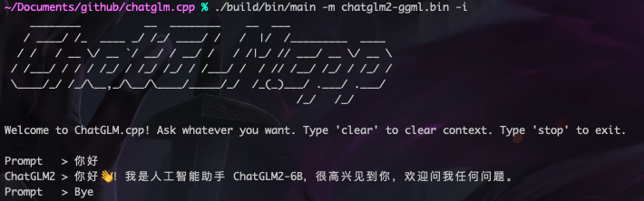
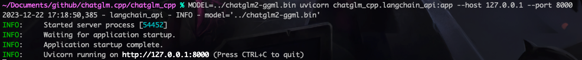

# 部署一个LangChain应用

#### 1. 准备工作

环境：macOS

1. 安装python3.8的环境；安装cmake
2. 将python3.8替换软连接
3. 升级pip

过程如下：

```bash
brew install python@3.8 cmake
sudo ln -s /opt/homebrew/bin/python3.8 /usr/local/bin/python
python -m pip install --upgrade pip
```

#### 2. 部署chatglm\_cpp



按github上start过程，下载代码，依赖，模型，编译。如下

```bash
git clone --recursive https://github.com/li-plus/chatglm.cpp.git && cd chatglm.cpp
pip install torch tabulate tqdm transformers sentencepiece
python chatglm_cpp/convert.py -i THUDM/chatglm2-6b -t f16 -o chatglm2-ggml.bin
cmake -B build
cmake --build build -j --config Release
```

这些完成以后可以尝试模型的交互效果。与README的示意图一致。但在M1环境下确实很卡

<figure><figcaption></figcaption></figure>

#### 3. 启动LangChain api

1. 下载额外的python包
2. 然后在chatglm\_cpp目录下启动（这里与官方文档有出入）

```bash
pip install uvicorn fastapi pydantic_settings gradio
cd chatglm_cpp
MODEL=../chatglm2-ggml.bin uvicorn chatglm_cpp.langchain_api:app --host 127.0.0.1 --port 8000
```

效果如下图

<figure><figcaption></figcaption></figure>

#### 4. 测试LangChain api
